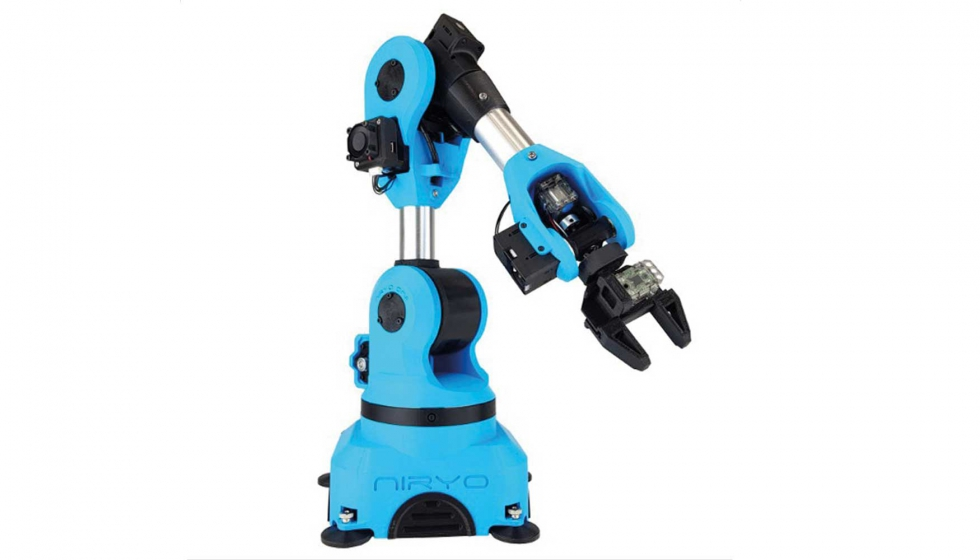
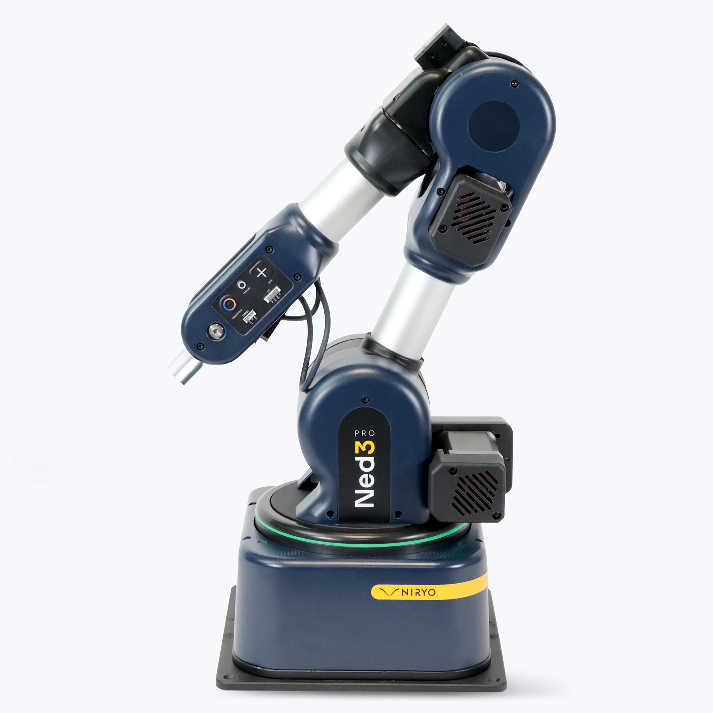
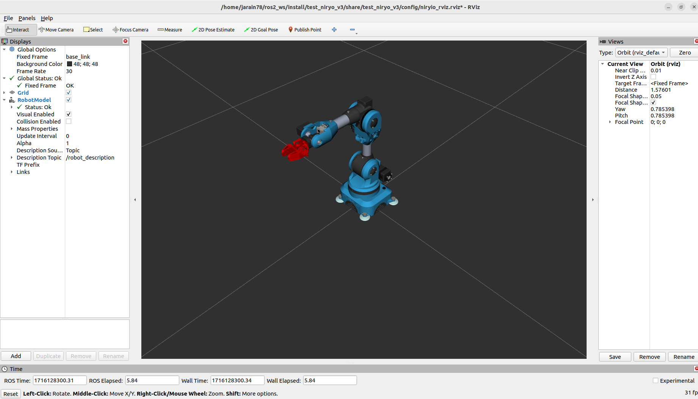
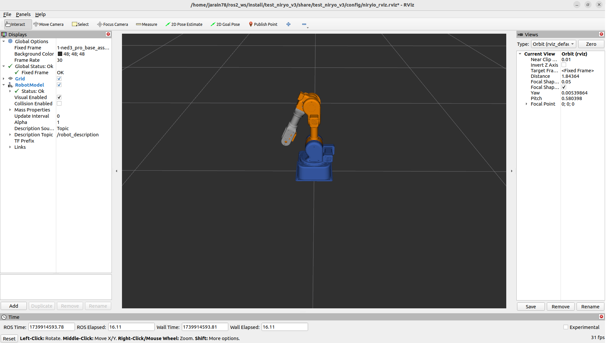

# Niryo Robot ROS 2 Humble


---

# Visualization of Niryo 2 Arm with ROS 2 Humble

This repository provides a detailed visualization of the [Niryo 2](https://www.youtube.com/watch?v=j6B_Yxa1IJQ)



and [Ned3](https://www.youtube.com/watch?v=RqCxjRdR3tw) robotic arm using ROS 2 Humble. Below are the instructions to launch the project and visualize the operation of the robotic arm.




## Introduction

The project is designed to demonstrate how ROS 2 Humble can be used to control and visualize the Niryo 2 robotic arm. ROS 2 (Robot Operating System) is a set of libraries and tools that help developers create robotic applications. This version, Humble Hawksbill, introduces improvements in node communication, robot control, and simulation tools.

## Prerequisites

Before starting, make sure you have the following requirements installed on your system:

- **Ubuntu 22.04** (recommended for full compatibility with ROS 2 Humble)
- **ROS 2 Humble Hawksbill**: You can follow the official installation instructions at [ROS 2 Humble Installation](https://docs.ros.org/en/humble/Installation.html).
- **rviz2**: A 3D visualization tool for ROS 2.

## Installation

Follow these steps to set up your environment and clone the repository:

1. **Install ROS 2 Humble**:

    ```sh
    sudo apt update
    sudo apt install ros-humble-desktop
    ```

2. **Set up the ROS 2 workspace**:

    ```sh
    mkdir -p ~/ros2_ws/src
    cd ~/row2_ws/src
    ```

3. **Clone this repository**:

    ```sh
    https://github.com/jarain78/NiryoRobotRosHumble.git
    cd ..
    rosdep install --from-paths src --ignore-src -r -y
    ```

4. **Build the workspace**:

    ```sh
    colcon build
    ```

5. **Source the workspace**:

    ```sh
    source install/setup.bash
    ```

## Launching the Project

To start the visualization of the Niryo 2 or Ned3 arm, use the following command:

## Ned2

```sh
ros2 launch test_niryo_v2 slider_control.launch.py
```

This command will launch the necessary nodes and open `rviz2` with the appropriate configuration to visualize the Niryo 2 arm in a 3D environment.



## Ned3

```sh
ros2 launch test_niryo_v3 slider_control.launch.py
```

Or copy and paste this .sh file into your workspace and run it.

```sh
run_niryo.sh
```
This command will launch the necessary nodes and open `rviz2` with the appropriate configuration to visualize the Ned3 arm in a 3D environment.




## Usage

Once the project is running, you can interact with the Niryo 2 or Ned3 arm through the `rviz2` interface. You can perform the following actions:

- **Control the arm's movement**: Use ROS 2 plugins to send motion commands.
- **Visualize the arm's state**: Monitor the position, orientation, and joint states of the arm in real time.
- **Simulations**: Conduct simulations to test different control algorithms and trajectory planning.

## Contributions

Contributions to this project are welcome. If you have improvements, fixes, or new features you would like to add, please follow these steps:

1. Fork this repository.
2. Create a new branch (`git checkout -b feature/new-feature`).
3. Make your changes and commit descriptive messages.
4. Submit a detailed pull request explaining your changes.

## Support

If you encounter any issues or have questions about using this repository, please open an issue on GitHub. You can also contact the project maintainers via email at [jarincon@ubu.es](jarincon@ubu.es).


